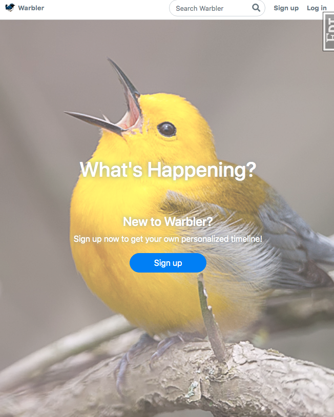
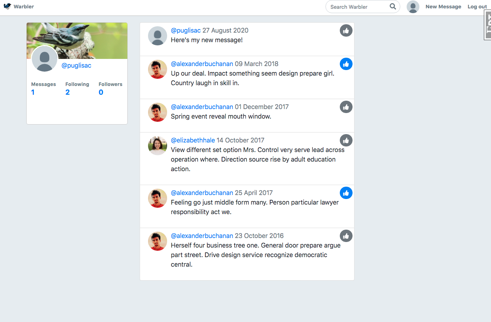
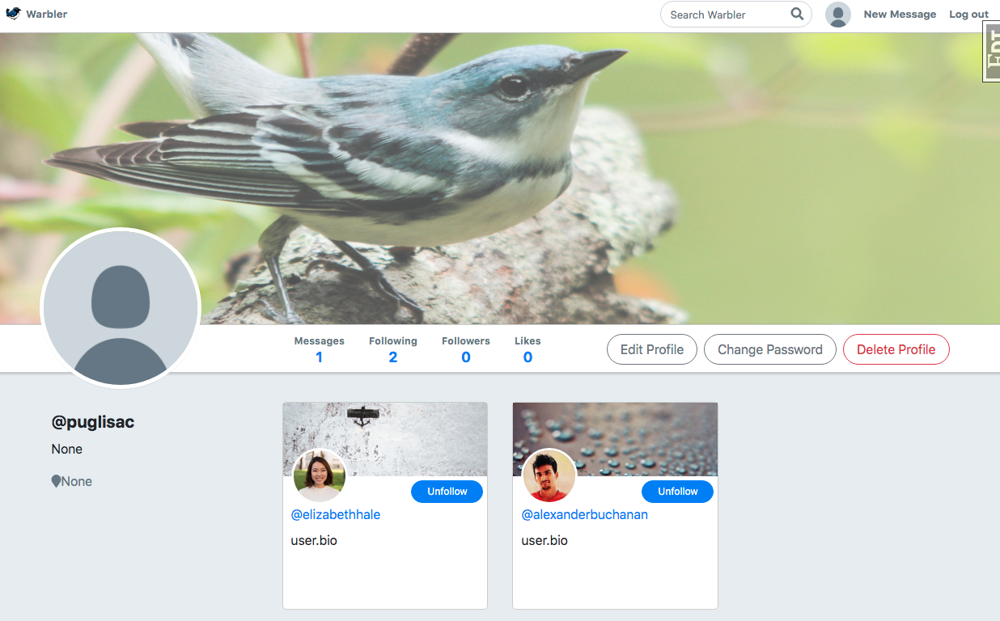
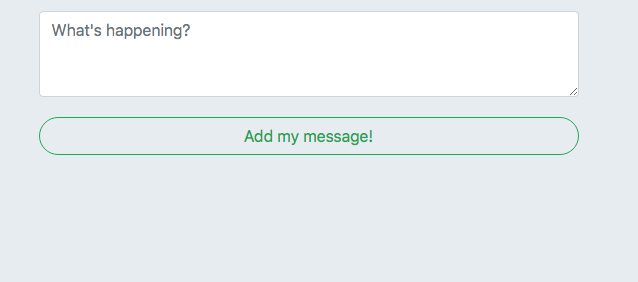
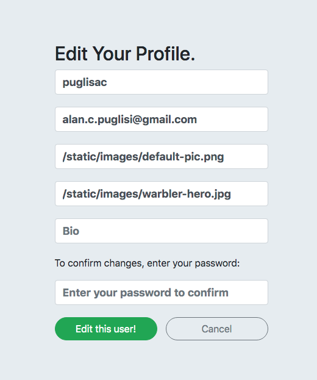

## Warbler
Warbler is a twitter clone.  



## Setup
Create the Python virtual environment:  

```
$ python3 -m venv venv
$ source venv/bin/activate
(venv) $ pip install -r requirements.txt
```
Set up the database:

```
(venv) $ createdb warbler
(venv) $ python seed.py
```
Start the server:

```
(venv) $ flask run
```

Once an account is created you can login and see your homepage with stories from the users you follow.  Click on the thumbs up to like posts.

 

Select users to follow: 

 

Add messages and edit your profile: 




You can also create admin users by setting "is_admin" to True.  Admin users are allowed to delete other users' posts and edit other users' profiles.  

## Built With

Python - backend  
PostgreSQL - database  
Flask SQLAlchemy - ORM for database  
FlaskWTForms - form render and validation
Flask Unittest - testing

**This app does not use password hashing**  
**Passwords are stored as text in the DB**